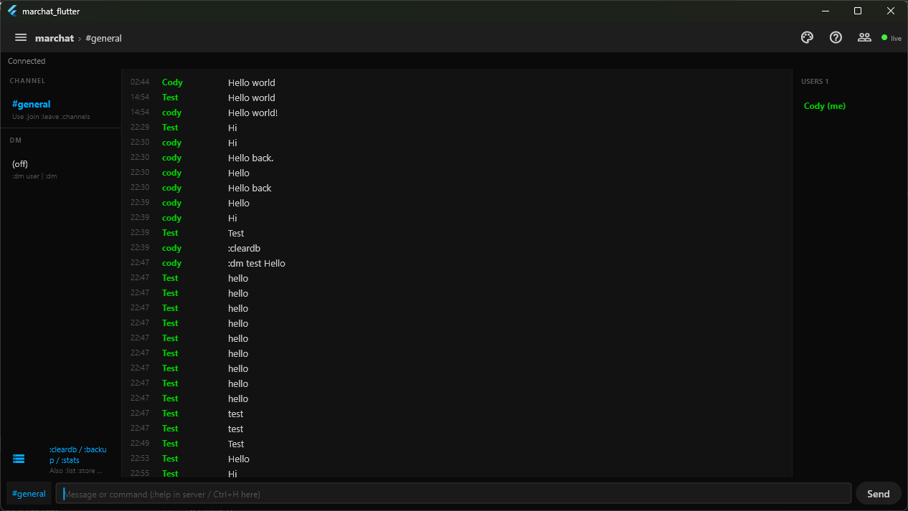

# marchat_flutter



Flutter desktop and multi-platform client for [marchat](https://github.com/Cod-e-Codes/marchat), a real-time chat server using WebSocket JSON and the same wire types as the official Go TUI client.

## Features

- Real-time messaging over WebSocket (string message types, admin commands, channels, DMs, structured commands aligned with the TUI)
- Optional global E2E: ChaCha20-Poly1305 on the wire, compatible with `shared.EncryptTextMessage` / `MARCHAT_GLOBAL_E2E_KEY`
- Unlock existing `keystore.dat` with the same passphrase and format as `client/crypto/keystore.go` (v3 portable header or legacy path-salt)
- File send and save
- Message list times use the device local timezone (same idea as the TUI when the server sends UTC in the JSON created_at field)
- Built-in chat themes matching TUI order: `system`, `patriot`, `retro`, `modern` (`:theme`, `:themes`, Ctrl+T)
- Admin commands (kick, ban, unban, allow, forcedisconnect, cleardb, backup, stats, plugin-style `:` commands to the server)

## Requirements

- Flutter stable in the 3.41.x line (tested with 3.41.7) and Dart 3.11.x as bundled with that SDK
- Dart SDK constraint for this package: see `pubspec.yaml` (`>=3.8.0 <4.0.0`)
- Git for Windows (or Git on your PATH) if you clone with Git
- **Windows desktop builds:** plugin builds need symlink support. Turn on **Developer Mode** in Windows Settings (Privacy and security, For developers), or run the build from an elevated shell. See Flutter Windows setup docs if `flutter build windows` fails with a symlink message.

## Branding

The same logo files as the [marchat](https://github.com/Cod-e-Codes/marchat) repo live under `assets/branding/` (`marchat-transparent.png` and `.svg`). The **in-app** UI is text only (no repeated logos). The PNG is used to generate **taskbar, window, and PWA/ favicon** icons. After changing the artwork, refresh those:

```bash
dart run flutter_launcher_icons
```

That overwrites platform launcher and `web/icons` from `assets/branding/marchat-transparent.png` (and updates web favicon when the tool does so).

## Setup

```
flutter pub get
```

## Run

Windows:

```
flutter run -d windows
```

## Test

```
flutter test
```

## Build

Windows:

```
flutter build windows --release
```

Linux (on Linux or WSL with a desktop toolchain):

```
sudo apt install -y clang cmake ninja-build pkg-config libgtk-3-dev liblzma-dev
flutter config --enable-linux-desktop
flutter build linux --release
```

Artifacts:

- Windows: `build/windows/x64/runner/Release/marchat_flutter.exe`
- Linux: `build/linux/x64/release/bundle/`

## Configuration

- Default server URL on the connect screen: `ws://localhost:8080/ws` (adjust for `wss://` behind a proxy as needed).
- Entry point: `lib/main.dart`. Main chat UI: `lib/screens/chat_screen.dart`.
- The connect screen can set **24-hour clock** and **built-in chat theme**; those values persist in SharedPreferences (`marchat_chat_twenty_four_hour`, `marchat_chat_theme_id`) and stay in sync when you use `:time`, `:theme`, or Ctrl+T in chat.

### E2E and keystore

1. **`MARCHAT_GLOBAL_E2E_KEY`** (base64, 32 raw bytes): if set in the environment, it takes precedence over a file-derived key (same as the Go client).
2. **Pasted global key** on the connect screen: optional; may be stored in secure storage when you save it from the field.
3. **`keystore.dat` + passphrase**: choose the same file the TUI uses and enter the same passphrase. Legacy v2 files use PBKDF2 with salt equal to the UTF-8 bytes of the **absolute path** of that file, so pick the real file path the Go client resolves (see `marchat-client -doctor` for config paths).

If E2E is enabled and none of the above apply, connect will fail until you provide a key or a valid keystore. The TUI generates a random global key on first use and writes it into `keystore.dat`; Flutter does not yet create a brand-new keystore from only a passphrase (use the TUI once, or set `MARCHAT_GLOBAL_E2E_KEY`).

## Admin commands

When connected as admin, you can send the same `:` commands as the server expects, for example:

```
:cleardb
:backup
:stats
:kick <user>
:ban <user>
:unban <user>
:allow <user>
:forcedisconnect <user>
```

Use in-app help (Ctrl+H) and the marchat TUI help for the full command set.

## License

This project is licensed under the MIT License. See the [LICENSE](LICENSE) file for details.
